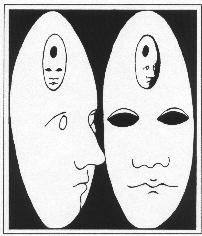

.. PsychSim documentation master file, created by
   sphinx-quickstart on Thu Oct 11 22:38:49 2018.
   You can adapt this file completely to your liking, but it should at least
   contain the root `toctree` directive.

Welcome to PsychSim's documentation!
====================================

    "I never satisfy myself until I can make a mechanical model of a thing. If I can make a mechanical model, I can understand it. As long as I cannot make a mechanical model all the way through I cannot understand it."

    -- Lord Kelvin

.. toctree::
   :maxdepth: 2
   :caption: Contents:

   installing
   modeling
   simulating

Indices and tables
==================

* :ref:`genindex`
* :ref:`modindex`
* :ref:`search`

  
